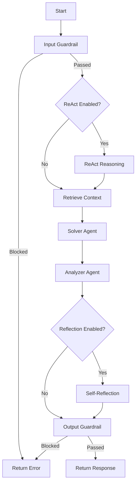

# 🤖 Multi-Agent RAG System with LLM Orchestration

A production-ready **Multi-Agent LLM System** to overcome hallucinations built with LangChain and LangGraph, featuring **Retrieval-Augmented Generation (RAG)**, **self-reflection**, **ReAct reasoning**, and comprehensive **guardrails**. Designed for scalable, reliable AI-powered document Q&A.


---

## 📋 Table of Contents

- [Features](#-features)
- [Architecture Overview](#-architecture-overview)
- [Agent Design](#-agent-design)
- [RAG Pipeline](#-rag-pipeline)
- [Project Structure](#-project-structure)
- [Installation](#-installation)
- [Quick Start](#-quick-start)
- [Docker Deployment](#-docker-deployment)
- [Configuration](#-configuration)
- [Testing](#-testing)
- [Evaluation Metrics](#-evaluation-metrics)
- [Observability Stack](#-observability-stack)
- [API Reference](#-api-reference)
- [Contributing](#-contributing)

---

## ✨ Features

### Multi-Agent Orchestration
- **LangGraph Workflow** - State machine-based agent coordination
- **Dynamic Routing** - Automatic task delegation based on query type
- **Self-Reflection** - Agents critique and improve their own responses
- **ReAct Reasoning** - Explicit "Thought → Action → Observation" loops

### RAG Pipeline
- **Hybrid Search** - BM25 keyword + vector semantic search ensemble
- **PDF Document Loading** - Native PDF parsing and chunking
- **Chroma Vector Store** - Persistent vector database with Google embeddings

### Production Features
- **Input/Output Guardrails** - Prompt injection detection, content filtering
- **Conversation Memory** - Short-term buffer + long-term summarization
- **Cost Control** - Token tracking and budget management
- **Response Caching** - Redis-backed caching for repeated queries
- **Distributed Tracing** - OpenTelemetry + Jaeger integration

### MLOps Ready
- **CI/CD Pipeline** - GitHub Actions with lint, test, build
- **Docker Compose** - Microservices deployment
- **Comprehensive Tests** - 18 test modules with mocked API calls

---

## 🏗 Architecture Overview

```
┌─────────────────────────────────────────────────────────────────────────────┐
│                              CLIENT REQUEST                                 │
└─────────────────────────────────────────────────────────────────────────────┘
                                      │
                                      ▼
┌─────────────────────────────────────────────────────────────────────────────┐
│                         INFERENCE SERVICE (Port 8000)                       │
│  ┌───────────────────────────────────────────────────────────────────────┐  │
│  │                           ORCHESTRATOR                                │  │
│  │  ┌─────────────┐    ┌─────────────┐    ┌─────────────────────────┐   │  │
│  │  │   INPUT     │───▶│   RETRIEVE  │───▶│  SOLVE / ANALYZE / CHAT │   │  │
│  │  │  GUARDRAIL  │    │   CONTEXT   │    │                         │   │  │
│  │  └─────────────┘    └─────────────┘    └─────────────────────────┘   │  │
│  │         │                                          │                  │  │
│  │         ▼                                          ▼                  │  │
│  │  ┌─────────────┐                         ┌─────────────────────────┐ │  │
│  │  │   ReAct     │                         │    SELF-REFLECTION      │ │  │
│  │  │  REASONING  │                         │    (Critique & Refine)  │ │  │
│  │  └─────────────┘                         └─────────────────────────┘ │  │
│  │                                                    │                  │  │
│  │                                                    ▼                  │  │
│  │                                          ┌─────────────────────────┐ │  │
│  │                                          │    OUTPUT GUARDRAIL     │ │  │
│  │                                          └─────────────────────────┘ │  │
│  └───────────────────────────────────────────────────────────────────────┘  │
└─────────────────────────────────────────────────────────────────────────────┘
                                      │
                                      ▼
┌─────────────────────────────────────────────────────────────────────────────┐
│                          RAG SERVICE (Port 8001)                            │
│  ┌───────────────┐    ┌───────────────┐    ┌───────────────────────────┐   │
│  │  PDF LOADER   │───▶│ TEXT CHUNKER  │───▶│    HYBRID RETRIEVER       │   │
│  │               │    │               │    │  ┌─────────┬──────────┐   │   │
│  └───────────────┘    └───────────────┘    │  │  BM25   │  Vector  │   │   │
│                                            │  │ Search  │  Search  │   │   │
│                                            │  └─────────┴──────────┘   │   │
│                                            └───────────────────────────┘   │
│                                                         │                   │
│                                                         ▼                   │
│                                            ┌───────────────────────────┐   │
│                                            │   CHROMA VECTOR STORE     │   │
│                                            │  (Google Embeddings)      │   │
│                                            └───────────────────────────┘   │
└─────────────────────────────────────────────────────────────────────────────┘
                                      │
                                      ▼
┌─────────────────────────────────────────────────────────────────────────────┐
│                         OBSERVABILITY STACK (Optional)                      │
│  ┌─────────────┐    ┌─────────────┐    ┌─────────────┐    ┌─────────────┐  │
│  │    Redis    │    │   Jaeger    │    │ Prometheus  │    │   Grafana   │  │
│  │   Caching   │    │   Tracing   │    │   Metrics   │    │  Dashboard  │  │
│  └─────────────┘    └─────────────┘    └─────────────┘    └─────────────┘  │
└─────────────────────────────────────────────────────────────────────────────┘
```

---

## 🤖 Agent Design

### Agent Types

```
┌──────────────────────────────────────────────────────────────────────────┐
│                           AGENT HIERARCHY                                │
├──────────────────────────────────────────────────────────────────────────┤
│                                                                          │
│   ┌────────────────────────────────────────────────────────────────┐    │
│   │                      ORCHESTRATOR                               │    │
│   │  (LangGraph StateGraph - Coordinates all agents)                │    │
│   └────────────────────────────────────────────────────────────────┘    │
│                                │                                         │
│         ┌──────────────────────┼──────────────────────┐                 │
│         ▼                      ▼                      ▼                 │
│   ┌───────────┐          ┌───────────┐          ┌───────────┐          │
│   │  SOLVER   │          │  CHATBOT  │          │ ANALYZER  │          │
│   │  Agent    │          │   Agent   │          │   Agent   │          │
│   └───────────┘          └───────────┘          └───────────┘          │
│                                                                          │
│   Enhanced Capabilities:                                                 │
│   ┌───────────────────┐         ┌───────────────────────────┐          │
│   │   ReAct Agent     │         │   Reflective Agent        │          │
│   │ (Reason + Act)    │         │   (Self-Critique)         │          │
│   └───────────────────┘         └───────────────────────────┘          │
│                                                                          │
└──────────────────────────────────────────────────────────────────────────┘
```

### Agent Descriptions

| Agent | Purpose | Key Features |
|-------|---------|--------------|
| **Orchestrator** | Coordinates agent workflow | LangGraph state machine, conditional routing, guardrail integration |
| **SolverAgent** | Step-by-step problem solving | Context-aware solutions, structured output |
| **ChatbotAgent** | General Q&A interaction | Memory support, multi-turn conversations |
| **AnalyzerAgent** | Solution verification | Accuracy checking, completeness analysis |
| **ReActAgent** | Explicit reasoning | Thought → Action → Observation loop |
| **ReflectiveAgent** | Self-improvement | Critique → Refine cycle, quality scoring |

### Orchestrator Workflow (LangGraph)



---

## 🔍 RAG Pipeline

### Hybrid Retrieval Architecture

```
┌─────────────────────────────────────────────────────────────────────┐
│                        QUERY INPUT                                  │
└─────────────────────────────────────────────────────────────────────┘
                               │
                               ▼
┌─────────────────────────────────────────────────────────────────────┐
│                     HYBRID RETRIEVER                                │
│  ┌─────────────────────────┐    ┌─────────────────────────────┐    │
│  │      BM25 RETRIEVER     │    │     VECTOR RETRIEVER        │    │
│  │    (Keyword Search)     │    │   (Semantic Similarity)     │    │
│  │                         │    │                             │    │
│  │  • TF-IDF scoring       │    │  • Google Embeddings        │    │
│  │  • Exact term matching  │    │  • Cosine similarity        │    │
│  │  • Fast for keywords    │    │  • Contextual understanding │    │
│  └─────────────────────────┘    └─────────────────────────────┘    │
│            │ Weight: 0.5              │ Weight: 0.5                │
│            └──────────┬───────────────┘                            │
│                       ▼                                             │
│            ┌─────────────────────┐                                 │
│            │  ENSEMBLE MERGER    │                                 │
│            │  (Weighted Fusion)  │                                 │
│            └─────────────────────┘                                 │
└─────────────────────────────────────────────────────────────────────┘
                               │
                               ▼
                    TOP-K RELEVANT DOCUMENTS
```

### Document Processing Pipeline

```
PDF Files → PDFLoader → Text Extraction → RecursiveTextSplitter → Chunks
                                                    │
                                                    ▼
                              ┌──────────────────────────────────────┐
                              │           CHUNK SETTINGS             │
                              │  • Chunk Size: 1000 characters       │
                              │  • Chunk Overlap: 200 characters     │
                              │  • Separator: Recursive (paragraphs) │
                              └──────────────────────────────────────┘
                                                    │
                                                    ▼
                    Chunks → Google Embeddings → Chroma Vector Store
```

---

## 📁 Project Structure

```
Project/
├── 📄 main.py                      # CLI entry point
├── 📄 evaluate.py                  # Evaluation runner
├── 📄 requirements.txt             # Python dependencies
├── 📄 docker-compose.yml           # Microservices orchestration
├── 📄 .env.example                 # Environment template
│
├── 📁 src/                         # Source code
│   ├── 📁 agents/                  # Agent implementations
│   │   ├── orchestrator.py         # LangGraph workflow coordinator
│   │   ├── solver.py               # Problem-solving agent
│   │   ├── chatbot.py              # Conversational agent
│   │   ├── analyzer.py             # Solution analysis agent
│   │   ├── react_agent.py          # ReAct reasoning agent
│   │   ├── reflective_agent.py     # Self-reflection agent
│   │   ├── guardrails.py           # Input/output validation
│   │   ├── error_handling.py       # Error handling utilities
│   │   └── tools.py                # Agent tools (calculator, search)
│   │
│   ├── 📁 rag/                     # RAG components
│   │   ├── loader.py               # PDF document loader
│   │   ├── vectorstore.py          # Chroma vector store manager
│   │   ├── retriever.py            # Hybrid BM25+Vector retriever
│   │   └── freshness_tracker.py    # Document staleness detection
│   │
│   ├── 📁 memory/                  # Conversation memory
│   │   ├── memory_manager.py       # Unified memory interface
│   │   └── conversation_memory.py  # Buffer + summarization memory
│   │
│   ├── 📁 evaluation/              # Evaluation framework
│   │   ├── metrics.py              # ROUGE-L, AI Judge, etc.
│   │   └── continuous_eval.py      # Continuous evaluation
│   │
│   ├── 📁 scaling/                 # Scalability features
│   │   ├── request_batcher.py      # Request batching
│   │   └── tracing.py              # OpenTelemetry tracing
│   │
│   ├── 📁 monitoring/              # Observability
│   │   ├── alert_manager.py        # Alert system
│   │   └── drift_detector.py       # Model drift detection
│   │
│   └── 📁 utils/                   # Utilities
│       ├── config.py               # Configuration loader
│       ├── cache.py                # Redis caching
│       ├── cost_controller.py      # Token/cost tracking
│       └── token_manager.py        # Token counting & truncation
│
├── 📁 services/                    # Microservices
│   ├── 📁 rag_service/             # Document retrieval service
│   │   ├── Dockerfile
│   │   ├── app.py                  # FastAPI app (port 8001)
│   │   └── requirements.txt
│   │
│   └── 📁 inference_service/       # LLM inference service
│       ├── Dockerfile
│       ├── app.py                  # FastAPI app (port 8000)
│       └── requirements.txt
│
├── 📁 tests/                       # Test suite (18 modules)
│   ├── conftest.py                 # Pytest fixtures
│   ├── test_agents.py
│   ├── test_guardrails.py
│   ├── test_retriever.py
│   ├── test_memory_manager.py
│   ├── test_metrics.py
│   └── ... (13 more test files)
│
├── 📁 data/                        # Data directory
│   └── pdfs/                       # PDF documents for RAG
│
└── 📁 .github/workflows/           # CI/CD
    └── ci_cd.yml                   # GitHub Actions pipeline
```

---

## 🚀 Installation

### Prerequisites
- Python 3.9+
- Docker & Docker Compose (for containerized deployment)
- Google AI API Key

### Local Setup

```bash
# Clone the repository
git clone https://github.com/your-username/AI-Math-Agent---LLM.git
cd AI-Math-Agent---LLM/Project

# Create virtual environment
python -m venv .venv
source .venv/bin/activate  # Linux/Mac
# .venv\Scripts\activate   # Windows

# Install dependencies
pip install -r requirements.txt

# Configure environment
cp .env.example .env
# Edit .env and add your GOOGLE_API_KEY
```

### Configuration
Edit `.env` with your settings:
```env
# Required
GOOGLE_API_KEY=your_google_api_key_here

# Model Configuration
LLM_MODEL=gemini-pro
EMBEDDING_MODEL=models/embedding-001

# RAG Settings
CHUNK_SIZE=1000
CHUNK_OVERLAP=200
RETRIEVER_K=3
BM25_WEIGHT=0.5
VECTOR_WEIGHT=0.5
```

---

## ⚡ Quick Start

### 1. Add Documents
Place PDF files in `data/pdfs/` directory.

### 2. Run Interactive Mode
```bash
python main.py
```

### 3. Example Interaction
```
--- Multi-Agent RAG System ---
Loading data...
Setting up RAG pipeline...
Created 45 chunks from documents.
Initializing Agents...
System Ready! Type 'exit' to quit.

Enter your query: What are the main concepts discussed in the document?

Processing...
--- Result ---
Problem: What are the main concepts discussed in the document?
Context Retrieved: 2847 chars
Solution: Based on the document, the main concepts include...
Analysis: The solution accurately addresses the query...
----------------
```

---

## 🐳 Docker Deployment

### Quick Deploy
```bash
# Start all services
docker-compose up -d

# Check health
curl http://localhost:8000/health  # Inference service
curl http://localhost:8001/health  # RAG service
```

### Service Architecture
| Service | Port | Description |
|---------|------|-------------|
| `inference-service` | 8000 | LLM agents, orchestration |
| `rag-service` | 8001 | Document retrieval |
| `redis` | 6379 | Response caching |
| `jaeger` | 16686 | Distributed tracing UI |
| `prometheus` | 9090 | Metrics collection |
| `grafana` | 3000 | Dashboards |

### API Example
```bash
# Send a query
curl -X POST http://localhost:8000/chat \
  -H "Content-Type: application/json" \
  -d '{"query": "Explain the key concepts"}'
```

---

## ⚙️ Configuration

### Environment Variables

| Variable | Default | Description |
|----------|---------|-------------|
| `GOOGLE_API_KEY` | Required | Google AI API key |
| `LLM_MODEL` | `gemini-pro` | LLM model name |
| `EMBEDDING_MODEL` | `models/embedding-001` | Embedding model |
| `CHUNK_SIZE` | `1000` | Document chunk size |
| `CHUNK_OVERLAP` | `200` | Chunk overlap |
| `RETRIEVER_K` | `3` | Number of documents to retrieve |
| `BM25_WEIGHT` | `0.5` | BM25 retriever weight |
| `VECTOR_WEIGHT` | `0.5` | Vector retriever weight |
| `MEMORY_BUFFER_SIZE` | `10` | Memory buffer size |
| `CACHE_ENABLED` | `true` | Enable Redis caching |
| `REDIS_URL` | `redis://redis:6379` | Redis connection URL |
| `DAILY_BUDGET_USD` | `10.0` | Daily cost limit |
| `TRACING_ENABLED` | `false` | Enable OpenTelemetry tracing |

---

## 🧪 Testing

### Run All Tests
```bash
# With coverage
pytest tests/ -v --cov=src --cov-report=term-missing

# Specific test module
pytest tests/test_agents.py -v
```

### Test Coverage
| Module | Tests | Coverage |
|--------|-------|----------|
| `agents/` | 6 files | Core agent logic |
| `rag/` | 3 files | Retrieval pipeline |
| `memory/` | 2 files | Conversation memory |
| `evaluation/` | 1 file | Metrics calculation |
| `utils/` | 4 files | Caching, tokens, cost |
| `scaling/` | 2 files | Batching, tracing |

---

## 📊 Evaluation Metrics

### Available Metrics

| Metric | Description | Range |
|--------|-------------|-------|
| **Functional Correctness** | Keyword presence in response | 0.0 - 1.0 |
| **Lexical Exactness** | Sequence matching similarity | 0.0 - 1.0 |
| **ROUGE-L** | Longest Common Subsequence F1 | 0.0 - 1.0 |
| **AI Judge** | LLM-based quality scoring | 0.0 - 1.0 |

### Running Evaluation
```bash
python evaluate.py
```

---

## 🔭 Observability Stack

### Enable Full Observability
```bash
# Start with all optional services
docker-compose up -d

# Access dashboards
open http://localhost:16686  # Jaeger (Tracing)
open http://localhost:9090   # Prometheus (Metrics)
open http://localhost:3000   # Grafana (Dashboards)
```

### Features
- **Distributed Tracing** - Track requests across services
- **Metrics** - Token usage, latency, error rates
- **Alerting** - Cost thresholds, drift detection
- **Caching Stats** - Hit/miss ratios

---

## 📡 API Reference

### Inference Service (Port 8000)

#### Health Check
```http
GET /health
```
Response:
```json
{"status": "healthy", "agents_loaded": true}
```

#### Chat
```http
POST /chat
Content-Type: application/json

{"query": "Your question here"}
```
Response:
```json
{
  "query": "Your question here",
  "context_length": 2847,
  "solution": "Step-by-step solution...",
  "analysis": "Solution analysis..."
}
```

### RAG Service (Port 8001)

#### Retrieve Documents
```http
POST /retrieve
Content-Type: application/json

{"query": "Search query", "top_k": 5}
```
Response:
```json
{
  "query": "Search query",
  "documents": [
    {"content": "Document content...", "metadata": {"source": "file.pdf"}}
  ]
}
```

---

## 🔒 Security

This project follows security best practices:

- ✅ **No hardcoded secrets** - All sensitive data via environment variables
- ✅ **`.env` excluded from git** - Properly configured `.gitignore`
- ✅ **Input validation** - Guardrails prevent prompt injection
- ✅ **Output filtering** - Credential leak detection
- ✅ **Mock keys in tests** - CI/CD uses dummy API keys

---

## 🤝 Contributing

1. Fork the repository
2. Create a feature branch (`git checkout -b feature/amazing-feature`)
3. Run tests (`pytest tests/ -v`)
4. Commit changes (`git commit -m 'Add amazing feature'`)
5. Push to branch (`git push origin feature/amazing-feature`)
6. Open a Pull Request

---

## 📄 License

This project is licensed under the MIT License - see the [LICENSE](LICENSE) file for details.

---

## 🙏 Acknowledgments

- [LangChain](https://langchain.com/) - LLM framework
- [LangGraph](https://github.com/langchain-ai/langgraph) - Agent orchestration
- [Google Generative AI](https://ai.google.dev/) - Gemini models
- [Chroma](https://www.trychroma.com/) - Vector database

---

<div align="center">
  <sub>Built with ❤️ using LangChain, LangGraph, and Google AI</sub>
</div>
