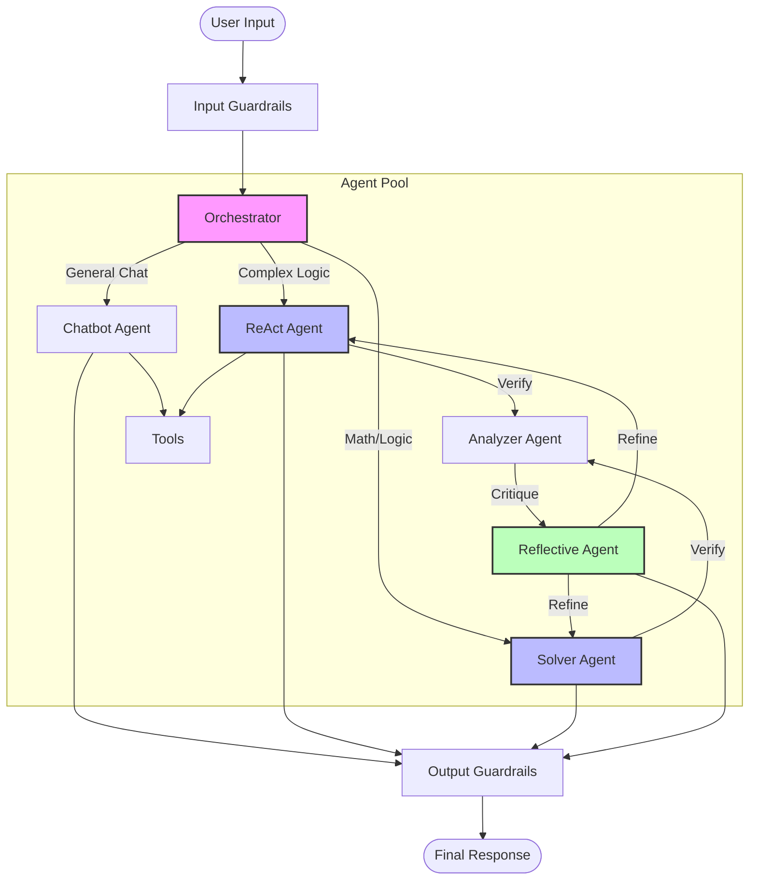
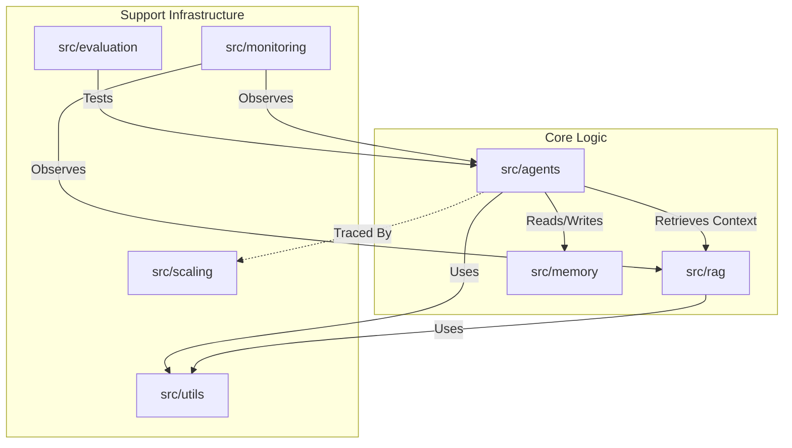
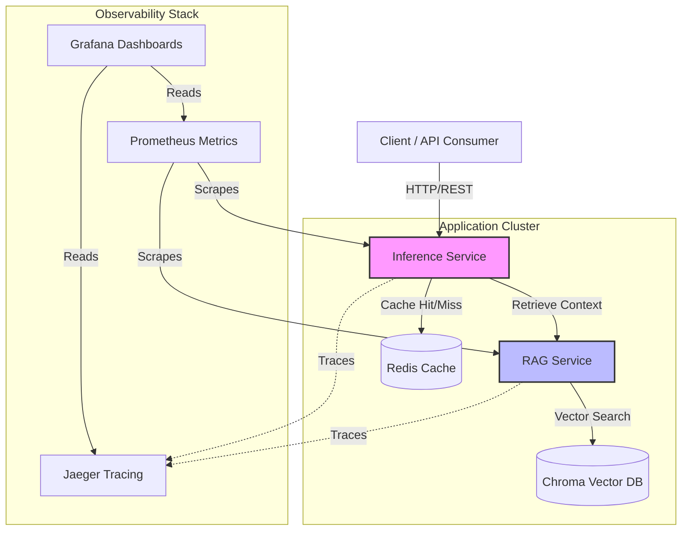

# 🤖 Multi-Agent RAG System with LLM Orchestration

This project is derived from my previous work on multi-agent systems and advanced AI architectures. Because the original work remains private and proprietary to my company, this repository serves as an open-source implementation of those concepts—sharing the fundamental architecture and core modules, while omitting certain complex proprietary industrial features.

It is a production-ready **Multi-Agent LLM System** built with **LangChain** and **LangGraph**, featuring **Retrieval-Augmented Generation (RAG)**, **self-reflection**, **ReAct reasoning**, and comprehensive **guardrails**. It is designed for scalable, reliable AI-powered document Q&A, capable of running both in the cloud (Google Gemini) and locally (Ollama).


---

## 📋 Table of Contents

-   [Features](#-features)
-   [Architecture Overview](#-architecture-overview)
-   [System Modules](#-system-modules)
    -   [Agents](#agents-srcagents)
    -   [RAG Pipeline](#rag-pipeline-srcrag)
    -   [Memory](#memory-management-srcmemory)
    -   [Monitoring](#monitoring--observability-srcmonitoring)
-   [Installation](#-installation)
-   [Configuration](#-configuration)
-   [Running the System](#-running-the-system)
    -   [Cloud Mode (Gemini)](#cloud-mode-gemini)
    -   [Local Mode (Ollama)](#local-mode-ollama)
-   [Docker Deployment](#-docker-deployment)
-   [Testing](#-testing)
-   [Project Structure](#-project-structure)

---

## ✨ Features

### Multi-Agent Orchestration
-   **LangGraph Workflow** - State machine-based agent coordination.
-   **Dynamic Routing** - Automatic task delegation based on query type.
-   **Self-Reflection** - Agents critique and improve their own responses.
-   **ReAct Reasoning** - Explicit "Thought → Action → Observation" loops.

### RAG Pipeline
-   **Hybrid Search** - BM25 keyword + vector semantic search ensemble.
-   **PDF Document Loading** - Native PDF parsing and chunking.
-   **Chroma Vector Store** - Persistent vector database.
-   **Dual Model Support** - Google Gemini (Cloud) or Llama/Sentence-Transformers (Local).

### Production Features
-   **Input/Output Guardrails** - Prompt injection detection, content filtering.
-   **Conversation Memory** - Short-term buffer + long-term summarization.
-   **Cost Control** - Token tracking and budget management.
-   **Response Caching** - Redis-backed caching for repeated queries.
-   **Distributed Tracing** - OpenTelemetry + Jaeger integration.

---

## 🏗 Architecture Overview

The system uses a hub-and-spoke architecture where an **Orchestrator** manages the flow of information between specialized agents and the user.



---

## 📦 System Modules (`src`)

The system is organized into modular packages to ensure separation of concerns.



### Module Breakdown

#### 🧠 [Agents](src/agents/README.md)
The brain of the application.
| Component | Description |
|-----------|-------------|
| **Orchestrator** | Central `LangGraph` state machine that manages the workflow and routing. |
| **ReAct Agent** | Implements the **Reason+Act** paradigm for complex problem solving. |
| **Solver Agent** | Specialized in breaking down logic/math problems. |
| **Chatbot Agent** | Handles general conversational queries and maintains persona. |
| **Reflective Agent** | Performs self-reflection and detailed critique to improve quality. |
| **Guardrails** | Security layers ensuring input safety and output privacy. |

#### 📚 [RAG Pipeline](src/rag/README.md)
Handles document ingestion and context retrieval.
| Component | Description |
|-----------|-------------|
| **Hybrid Retriever** | Combines **BM25** (sparse) and **Vector** (dense) search with weighted fusion. |
| **Vector Store** | Interface for **ChromaDB**. Supports Google & HuggingFace embeddings. |
| **Document Loader** | Parses PDFs and handles text chunking with recursive splitting. |
| **Freshness Tracker** | Monitors source files to only re-index modified documents. |

#### 💾 [Memory Management](src/memory/README.md)
| Component | Description |
|-----------|-------------|
| **Memory Manager** | Unified interface for short-term and persistent memory. |
| **Conversation Buffer** | Manages context windows, automatically summarizing old terms. |

#### 🔭 [Monitoring](src/monitoring/README.md)
| Component | Description |
|-----------|-------------|
| **Drift Detector** | Analyzes query distribution to detect data/concept drift. |
| **Alert Manager** | Routes critical system health alerts to configured channels. |

#### ⚖️ [Scaling](src/scaling/README.md)
| Component | Description |
|-----------|-------------|
| **Request Batcher** | Aggregates multiple API calls to optimize throughput. |
| **Distributed Tracing** | OpenTelemetry integration for full-stack request visibility. |

#### 📊 [Evaluation](src/evaluation/README.md)
| Component | Description |
|-----------|-------------|
| **Metrics** | Implements ROUGE, BLEU, and custom correctness scores. |
| **Continuous Eval** | Automated testing of agent performance against ground truth. |

#### 🛠 [Utils](src/utils/README.md)
| Component | Description |
|-----------|-------------|
| **Config** | Centralized environment and configuration management. |
| **Caching** | Redis-backed response caching for latency reduction. |


---

## 🚀 Installation

### Prerequisites
-   **Python 3.9+**
-   **Docker & Docker Compose** (optional, for containerized deployment)
-   **Google AI API Key** (if using Cloud mode)
-   **Ollama** (if using Local mode)

### 1. Clone the Repository
```bash
git clone https://github.com/MissoumYoucef/Multi-Agent-LLM-AI-System.git
cd Multi-Agent-LLM-AI-System
```

### 2. Create Virtual Environment
```bash
python -m venv .venv
source .venv/bin/activate  # Linux/Mac
# .venv\Scripts\activate   # Windows
```

### 3. Install Dependencies
```bash
pip install -r requirements.txt
```

---

## ⚙️ Configuration

Copy the example environment file:
```bash
cp .env.example .env
```

Edit `.env` to match your desired setup.

### Key Environment Variables

| Variable | Default | Description |
|----------|---------|-------------|
| `GOOGLE_API_KEY` | None | Required for Cloud Mode (Gemini). |
| `USE_LOCAL` | `false` | Set to `true` to use Ollama instead of Google API. |
| `LOCAL_LLM_MODEL` | `llama3.2:1b` | Ollama model name for text generation. |
| `LOCAL_EMBEDDING_MODEL` | `sentence-transformers...` | HuggingFace model for embeddings. |
| `LLM_MODEL` | `gemini-pro` | Cloud model name. |
| `RETRIEVER_K` | `3` | Number of documents to retrieve. |
| `BM25_WEIGHT` | `0.5` | Weight for keyword search (0.0 - 1.0). |
## 📊 Observability & Monitoring

The system includes a full observability stack to monitor performance, trace requests, and debug issues.

### 🧱 Component Stack
- **Prometheus**: Collects and stores real-time metrics (latency, throughput, cache hits).
- **Grafana**: Provides visual dashboards for all metrics and traces.
- **Jaeger**: Distributed tracing to visualize the lifecycle of LLM requests.
- **Redis**: High-performance caching for response optimization and cost reduction.

### 🛠️ Local Setup (Binary Mode)
If you are running the system without Docker, you can start the observability services using the provided script:

1. **Start Services:**
   ```bash
   chmod +x run_local.sh
   ./run_local.sh
   ```
   *This script starts Prometheus, Grafana, Jaeger, and Redis in the background.*

2. **Verify Endpoints:**
   | Service | Local URL | Description |
   |---------|-----------|-------------|
   | **Grafana** | [http://localhost:3000](http://localhost:3000) | Main Dashboard UI |
   | **Prometheus** | [http://localhost:9091](http://localhost:9091) | Metrics Explorer |
   | **Jaeger** | [http://localhost:16686](http://localhost:16686) | Distributed Tracing UI |
   | **Redis** | `localhost:6379` | Caching Layer |

### 🐳 Docker Setup
The observability stack is fully integrated into the `docker-compose.yml`.

```bash
docker-compose up -d
```
All services are automatically provisioned with datasources and dashboards.

---

## 📤 Distribution & Safety

> [!CAUTION]
> **Sensitive Information Check:**
> Before pushing changes to a public repository, ensure that your `.env` file and `data/` directory are **NOT** staged. The repository's `.gitignore` is configured to protect these files.

### Standard Push Workflow
1. **Verify Status:** `git status` (should not show `.env`)
2. **Stage Configs:** `git add prometheus.yml grafana_provisioning/ run_local.sh`
3. **Commit:** `git commit -m "feat: integrate observability stack"`
4. **Push:** `git push origin main`

---
---

## ▶️ Running the System

You can run the system in two modes: **Cloud** (using Google Gemini) or **Local** (using Ollama).

### Cloud Mode (Gemini)
Best for performance and reasoning capability.

1.  Ensure `GOOGLE_API_KEY` is set in `.env`.
2.  Set `USE_LOCAL=false`.
3.  Add PDF documents to `data/pdfs/`.
4.  Run the application:
    ```bash
    python main.py
    ```

### Local Mode (Ollama)
Best for privacy and offline usage.

1.  **Install & Start Ollama:**
    Follow instructions at [ollama.com](https://ollama.com).
    ```bash
    ollama serve
    ```
2.  **Pull Required Models:**
    ```bash
    ollama pull llama3.2:1b
    ```
3.  **Configure `.env`:**
    Set `USE_LOCAL=true`.
4.  **Run the application:**
    ```bash
    python main.py
    ```

---

## 🐳 Docker Deployment

The system is fully containerized using a microservices architecture. This allows you to run all components (Inference, RAG, and Observability) with a single command.

### 1. Build and Start Services
```bash
# Build the images and start the containers in background
docker-compose up -d --build
```

### 2. Verify Container Status
```bash
docker-compose ps
```

### 3. Service Access Overview
| Service | Internal Port | External Port | Role |
|---------|---------------|---------------|------|
| `inference-service` | 8000 | [8000](http://localhost:8000) | Main Agent API |
| `rag-service` | 8001 | [8001](http://localhost:8001) | Retrieval Engine |
| `redis` | 6379 | 6379 | Response Cache |
| `jaeger` | 16686 | [16686](http://localhost:16686) | Tracing UI |
| `prometheus` | 9090 | [9090](http://localhost:9090) | Metrics |
| `grafana` | 3000 | [3000](http://localhost:3000) | Dashboards |

### 4. Important Docker Volumes
- `chroma_data`: Persists your vector database embeddings.
- `./data`: (Bind Mount) Local PDFs are automatically indexed from this folder.
- `redis_data`, `prometheus_data`, `grafana_data`: Persistent storage for monitoring data.

### 5. Connecting to Local Ollama
The `docker-compose.yml` is configured to connect to Ollama running on your host machine via `host.docker.internal:11434`. Ensure Ollama is running and accessible on your host.

## ☸️ Kubernetes Deployment

For production-grade deployment, the system includes full Kubernetes manifests in the `k8s/` directory.

### Prerequisites

1.  **kubectl**: Installed and configured.
2.  **Minikube** (or other cluster): Running.

### Quick Start (Minikube)

1.  **Build Images in Cluster:**
    ```bash
    eval $(minikube docker-env)
    docker build -t llm-rag-service:latest -f services/rag_service/Dockerfile .
    docker build -t llm-inference-service:latest -f services/inference_service/Dockerfile .
    ```

2.  **Create Namespace & Secrets:**
    ```bash
    kubectl apply -f k8s/namespace.yaml
    # If using Cloud Gemini
    kubectl create secret generic llm-secrets --from-literal=google-api-key="YOUR_KEY" -n llm-rag-system
    ```

3.  **Apply Configurations:**
    ```bash
    kubectl apply -f k8s/configmap-app.yaml -n llm-rag-system
    kubectl apply -f k8s/configmap-prometheus.yaml -n llm-rag-system
    kubectl apply -f k8s/configmap-grafana.yaml -n llm-rag-system
    ```

4.  **Deploy Services:**
    ```bash
    # Observability (Redis, Jaeger, Prometheus, Grafana)
    kubectl apply -f k8s/observability.yaml -n llm-rag-system
    
    # RAG & Inference
    kubectl apply -f k8s/rag-service.yaml -n llm-rag-system
    kubectl apply -f k8s/inference-service.yaml -n llm-rag-system
    ```

5.  **Access Services (Port Forwarding):**
    ```bash
    kubectl port-forward svc/grafana 3000:3000 -n llm-rag-system
    kubectl port-forward svc/inference-service 8000:8000 -n llm-rag-system
    ```


### Microservices Architecture

The system is deployed as a set of interacting containers orchestrated by Docker Compose.



### Service Endpoints
| Service | URL | Description |
|---------|-----|-------------|
| **Inference Service** | `http://localhost:8000` | Main Agent API |
| **RAG Service** | `http://localhost:8001` | Retrieval API |
| **Jaeger** | `http://localhost:16686` | Tracing UI |
| **Grafana** | `http://localhost:3000` | Monitoring Dashboards |

---

## 🧪 Testing

Run quality assurance tests to verify system integrity.

```bash
# Run all tests
pytest tests/ -v

# Run agent-specific tests
pytest tests/test_agents.py -v

# Run with coverage report
pytest tests/ --cov=src --cov-report=term-missing
```

---

## 📁 Project Structure

```
Project/
├── main.py                      # CLI Entry point
├── docker-compose.yml           # Service orchestration
├── requirements.txt             # Dependencies
├── .env.example                 # Config template
│
├── src/
│   ├── agents/                  # [Module] Agent logic & Orchestrator
│   ├── rag/                     # [Module] Retrieval (PDFs + Vector)
│   ├── memory/                  # [Module] Context management
│   ├── monitoring/              # [Module] Drift detection & Alerts
│   ├── evaluation/              # [Module] Metrics & Auto-eval
│   ├── scaling/                 # [Module] Batching & Tracing
│   └── utils/                   # [Module] Config & Caching
│
├── tests/                       # Pytest suite
└── data/                        # PDF storage & persistent DBs
```
