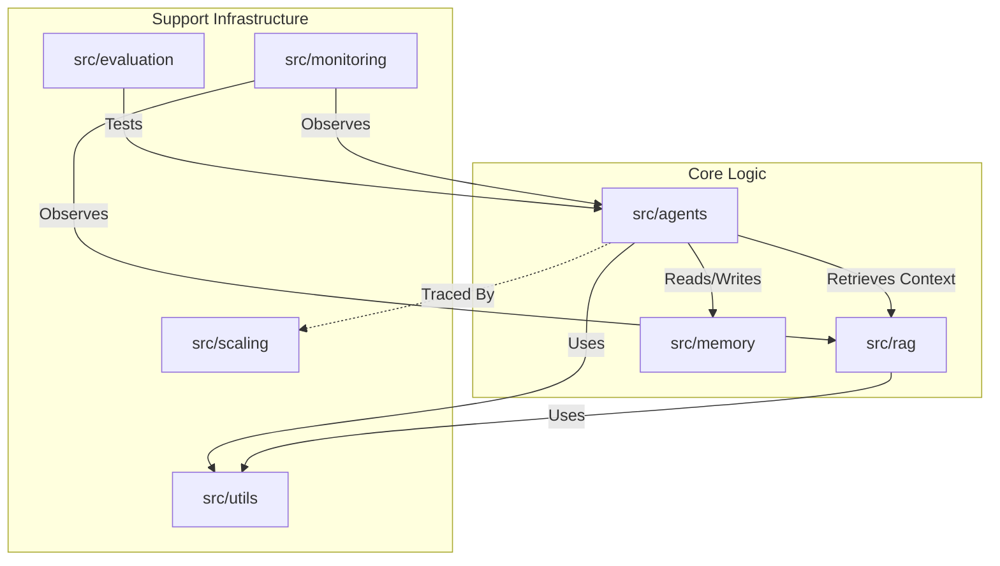

# 📦 Core Source Code (`src`)

The `src` directory contains the complete implementation of the Multi-Agent RAG System. It is organized into modular packages to ensure separation of concerns and scalability.

## 🏗 Package Architecture

The system is composed of several interacting modules. The **Modules** layer (Agents, RAG, Memory) relies on the **Infrastructure** layer (Utils, Scaling, Monitoring) to function effectively.

## 📂 Directory Breakdown

| Directory | Role | Key Dependencies |
|-----------|------|------------------|
| **[agents](./agents)** | Contains the brain of the application (Orchestrator, Chatbot, Solver). | `langgraph`, `langchain` |
| **[rag](./rag)** | Handles document processing, embedding, and retrieval. | `chromadb`, `pypdf`, `sentence-transformers` |
| **[memory](./memory)** | Manages conversation state and context windows. | `redis` (optional) |
| **[evaluation](./evaluation)** | Quality assurance tools and metrics (ROUGE, LLM Judge). | `rouge-score`, `pandas` |
| **[monitoring](./monitoring)** | Operational health checks, drift detection, and alerting. | `numpy`, `scipy` |
| **[scaling](./scaling)** | Performance optimization (batching) and distributed tracing. | `opentelemetry-api` |
| **[utils](./utils)** | Shared utilities, configuration, and caching logic. | `pydantic`, `python-dotenv` |
| **[training](./training)** | (Future) Model fine-tuning and alignment pipelines. | `torch`, `transformers` |
