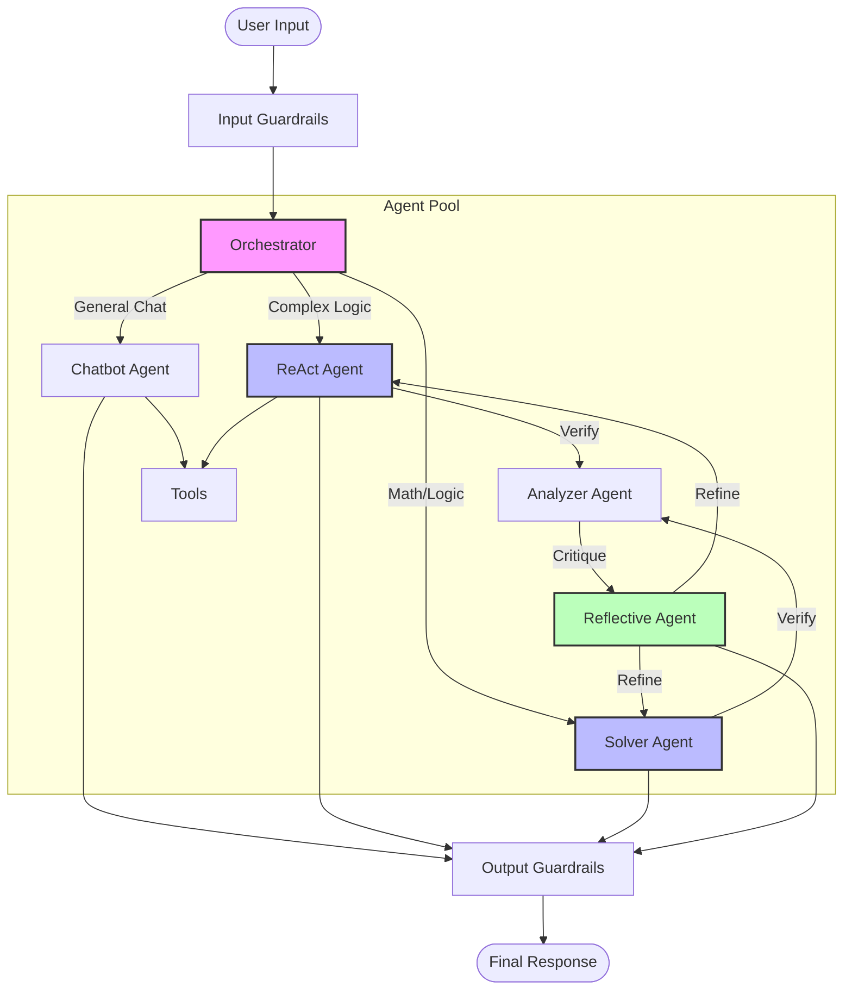

# 🧠 Agent System Design

This module implements the core **Multi-Agent Architecture** of the system. It uses **LangGraph** for stateful orchestration and distinct agent roles for specialized tasks.

## 🏗 Architecture

The `Orchestrator` acts as the central hub, routing user queries to the appropriate agent based on context and configuration. It enlists specific agents for reasoning, solving, critiquing, and chatting.

## 🧩 Components

| Component | File | Description |
|-----------|------|-------------|
| **Orchestrator** | `orchestrator.py` | Central `LangGraph` state machine that manages the workflow, state, and routing between agents. |
| **ReAct Agent** | `react_agent.py` | Implements the **Reason+Act** paradigm. It can use tools, observe results, and reason about the next step. |
| **Solver Agent** | `solver.py` | Specialized in breaking down and solving complex problems, often math or logic-based. |
| **Chatbot Agent** | `chatbot.py` | Handles general conversational queries, maintaining persona and context. |
| **Analyzer Agent** | `analyzer.py` | Reviews solutions provided by other agents for accuracy and completeness. |
| **Reflective Agent** | `reflective_agent.py` | Performs self-reflection and detailed critique to improve answer quality before final output. |
| **Guardrails** | `guardrails.py` | Security layer ensuring inputs are safe (prompt injection check) and outputs don't leak sensitive info. |
| **Error Handling** | `error_handling.py` | Robust error recovery mechanisms, retry logic, and fallback strategies. |
| **Tools** | `tools.py` | Collection of executable tools (search, calculator, etc.) available to the agents. |

## 🔄 Interaction Flow

1.  **Input Processing:** User query is checked by `Input Guardrails`.
2.  **Routing:** `Orchestrator` decides which agent to call (e.g., `ReAct` for research, `Solver` for math).
3.  **Execution:** The selected agent executes its logic, potentially calling `Tools`.
4.  **Verification (Optional):** `Analyzer` and `Reflective` agents review the output if high assurance is needed.
5.  **Output Processing:** Final answer is passed through `Output Guardrails` before being returned to the user.
