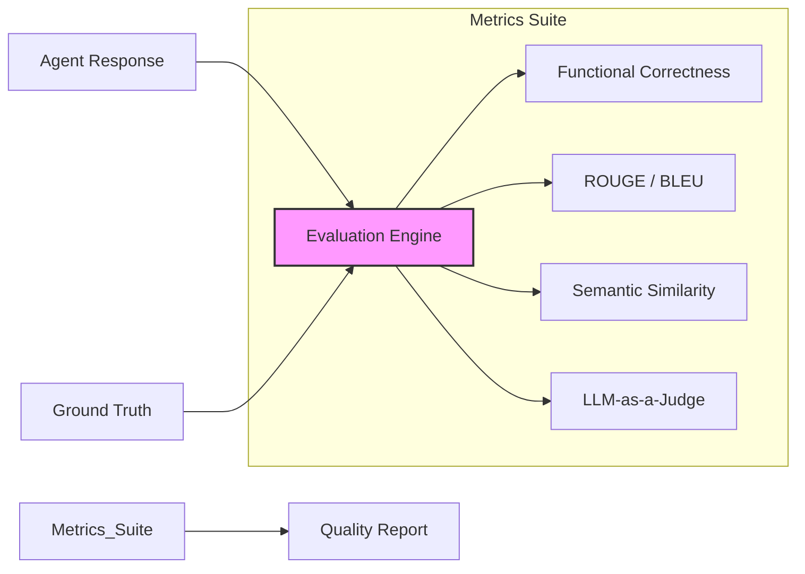

# 📊 Evaluation Framework

This module provides tools for **Quantitative and Qualitative Analysis** of the system's performance, ensuring the quality of agent responses and RAG retrieval.

## 🏗 Evaluation Flow

The framework supports both offline analysis (batch testing) and online monitoring (continuous evaluation) to track key performance indicators.

## 🧩 Components

| Component | File | Description |
|-----------|------|-------------|
| **Metrics Library** | `metrics.py` | Implementation of core evaluation metrics, including ROUGE scores, exact matching, and semantic similarity. |
| **Continuous Eval** | `continuous_eval.py` | System for running evaluations on a schedule or sampled from live traffic to detect drift or regression. |

## 🚀 Key Features

-   **Multi-Dimensional Scoring:** Evaluates answers not just for correctness, but for style, safety, and relevance.
-   **LLM Judge:** Uses a powerful LLM to grade the output of smaller/specialized agents.
-   **Regression Testing:** Can be used in CI/CD pipelines to ensure code changes don't degrade answer quality.
