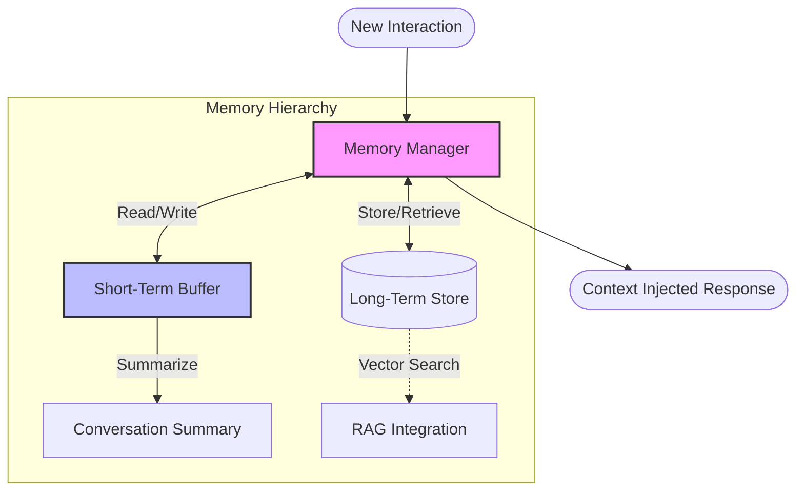

# 🧠 Memory Management System

This module provides the **Contextual Memory** capabilities for the agents, allowing them to maintain state across multi-turn conversations and recall past interactions.

## 🏗 Architecture

The memory system is designed with a tiered architecture, managing both immediate conversational context (Short-Term) and persistent state (Long-Term).

## 🧩 Components

| Component | File | Description |
|-----------|------|-------------|
| **Memory Manager** | `memory_manager.py` | The primary interface for agents to save and retrieve memory. It orchestrates the flow of information between different memory types. |
| **Conversation Memory** | `conversation_memory.py` | Implements the specific logic for short-term buffering and sliding windows. Handles the token counting and truncation to fit context windows. |

## 🚀 Key Features

-   **Context Window Management:** Automatically prunes or summarizes old messages to stay within LLM token limits.
-   **Summarization:** Condenses older parts of the conversation to retain key facts without consuming excessive tokens.
-   **Persistence:** Can serialize conversation history to disk/database (if configured) for session resumption.
