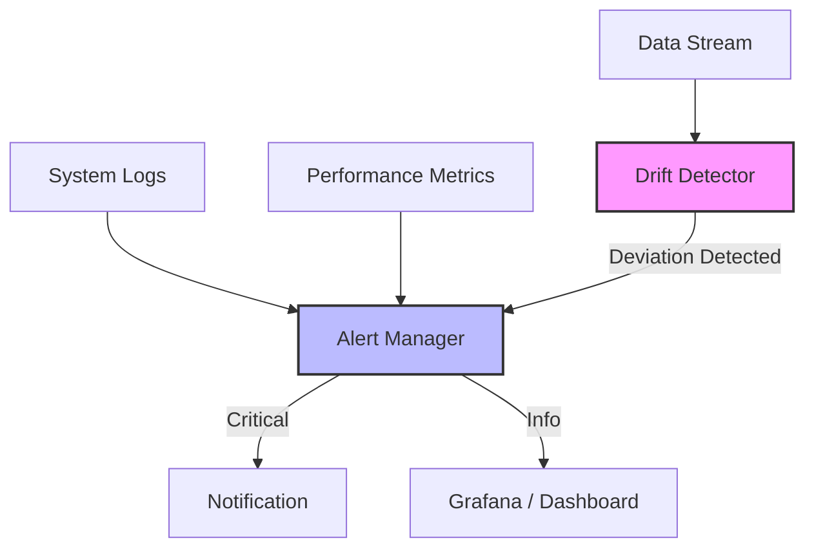

# 🔭 Monitoring & Observability

This module handles the **Operational Health** of the system, tracking reliability, performance, and data quality over time.

## 🏗 Monitoring Pipeline

The system proactively watches for anomalies in data distribution (drift) and system stability, alerting administrators when thresholds are breached.

## 🧩 Components

| Component | File | Description |
|-----------|------|-------------|
| **Drift Detector** | `drift_detector.py` | Statistical analysis of input queries and model outputs to detect "Data Drift" (changes in user behavior) or "Concept Drift" (model degradation). |
| **Alert Manager** | `alert_manager.py` | Configurable alerting engine that routes critical issues to the appropriate channels (logs, email, slack, etc.). |

## 🚀 Key Features

-   **Proactive Maintenance:** Identify failing models or changing user patterns before they fundamentally break the user experience.
-   **Thresholding:** customizable sensitivity for alerts to prevent alarm fatigue.
