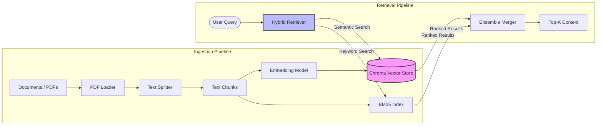

# 📚 RAG (Retrieval-Augmented Generation) Pipeline

This module implements a robust **Hybrid Retrieval System** that combines semantic vector search with keyword-based retrieval to ensure high-accuracy context injection for the agents.

## 🏗 Architecture

The RAG pipeline handles the ingestion of diverse document formats, processes them into retrievable chunks, and serves them via a sophisticated retrieval engine.

## 🧩 Components

| Component | File | Description |
|-----------|------|-------------|
| **Document Loader** | `loader.py` | Handles loading and parsing of raw documents (PDFs, text files). Validates formats and manages file I/O. |
| **Vector Store** | `vectorstore.py` | Interface for the **ChromaDB** vector database. Manages embeddings generation (Google Gemini/HuggingFace) and persistence. |
| **Hybrid Retriever** | `retriever.py` | Implements the retrieval logic, combining **BM25** (sparse) and **Vector** (dense) search with weighted fusion for optimal relevance. |
| **Freshness Tracker** | `freshness_tracker.py` | Monitors document sources for changes to ensure the knowledge base stays up-to-date and avoids stale data. |

## 🚀 Key Features

-   **Hybrid Search:** balances exact keyword matching with semantic understanding.
-   **Dynamic Embedding:** Supports switching between cloud (Google) and local (HuggingFace) logical embedding models.
-   **Persistence:** Data is persisted locally to ensure quick startup and state preservation.
-   **Staleness Checks:** Only re-indexes documents that have been modified.
