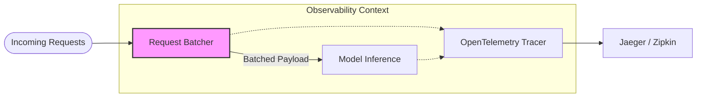

# ⚖️ Scaling & Distributed Infrastructure

This module provides mechanisms to handle **High Throughput** and ensure visibility across distributed service calls.

## 🏗 High-Performance Architecture

To handle volume, requests can be batched for efficient processing, and every action is traced to allow for debugging in a microservices environment.

## 🧩 Components

| Component | File | Description |
|-----------|------|-------------|
| **Request Batcher** | `request_batcher.py` | Aggregates multiple small requests into single API calls where possible to improve throughput and reduce IO overhead. |
| **Distributed Tracing** | `tracing.py` | Implements OpenTelemetry context propagation, allowing complete visualization of a request's lifecycle across services. |

## 🚀 Key Features

-   **Throughput Optimization:** Increases the number of requests handled per second by parallelizing IO and batching compute.
-   **Root Cause Analysis:** Tracing makes it possible to pinpoint exactly which component caused latency or failure in a complex chain.
