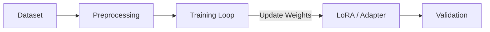

# 🎓 Training Pipeline

This directory is reserved for **Model Fine-Tuning** and training logic.

## 🚧 Status

*Currently, this module is a placeholder for future implementations involving:*

1.  **SFT (Supervised Fine-Tuning):** Tuning open weights models on specific domain data.
2.  **RLHF (Reinforcement Learning from Human Feedback):** Aligning agents using preference data.
3.  **Distillation:** Compressing larger model capabilities into smaller, faster local models.

## 🔮 Planned Architecture

