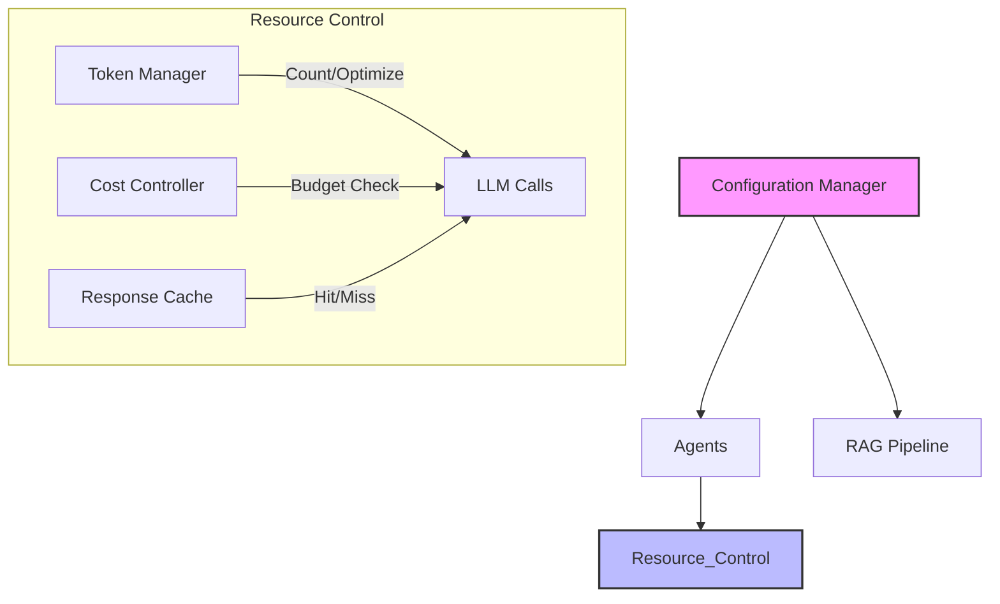

# 🛠 Utilities & Infrastructure

This module provides the essential **Cross-Cutting Concerns** and support services required by the entire application, including configuration, caching, and resource management.

## 🏗 System Interaction

These utilities act as the backbone, ensuring efficient operation and resource governance across all agents and services.

## 🧩 Components

| Component | File | Description |
|-----------|------|-------------|
| **Configuration** | `config.py` | Centralized loading of environment variables (API keys, model settings, paths) with validation. |
| **Response Cache** | `cache.py` | Redis-based caching system to store and retrieve frequent queries, reducing latency and cost. |
| **Cost Controller** | `cost_controller.py` | Tracks API usage and costs in real-time. Enforces daily budgets and rate limits. |
| **Token Manager** | `token_manager.py` | Utilities for counting tokens (using tiktoken/etc.) and ensuring prompts fit within model context windows. |

## 🚀 Key Features

-   **Budget Enforcement:** Prevents unexpected high bills by stopping requests when the daily limit is reached.
-   **Performance Optimization:** Caching significantly speeds up repeated queries.
-   **Safety:** Ensures that no request exceeds the model's maximum context length.
